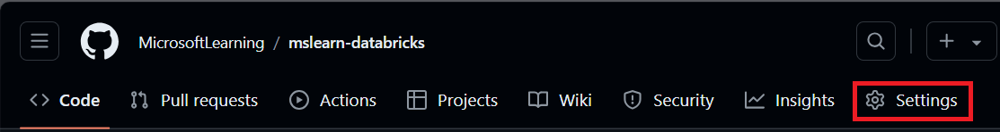

---
lab:
  title: Implementar fluxos de trabalho de CI/CD com o Azure Databricks
---

# Implementar fluxos de trabalho de CI/CD com o Azure Databricks

A implementação de fluxos de trabalho de CI/CD com o GitHub Actions e o Azure Databricks pode simplificar seu processo de desenvolvimento e aprimorar a automação. O GitHub Actions fornece uma plataforma poderosa para automatizar fluxos de trabalho de software, incluindo integração contínua (CI) e entrega contínua (CD). Quando integrados ao Azure Databricks, esses fluxos de trabalho podem executar tarefas de dados complexas, como rodar notebooks ou implantar atualizações para os ambientes de Databricks. Por exemplo, você pode usar o GitHub Actions para automatizar a implantação de notebooks do Databricks, gerenciar uploads do sistema de arquivos do Databricks e configurar a CLI do Databricks em seus fluxos de trabalho. Essa integração facilita um ciclo de desenvolvimento mais eficiente e resistente a erros, especialmente para aplicações orientadas a dados.

Este laboratório levará aproximadamente **30** minutos para ser concluído.

> **Observação**: a interface do usuário do Azure Databricks está sujeita a melhorias contínuas. A interface do usuário pode ter sido alterada desde que as instruções neste exercício foram escritas.

> **Observação:** você precisa de uma conta do GitHub e um cliente Git (como a ferramenta de linha de comando do Git) instalados no computador local para concluir este exercício.

## Provisionar um workspace do Azure Databricks

> **Dica**: Se você já tem um workspace do Azure Databricks, pode ignorar esse procedimento e usar o workspace existente.

Este exercício inclui um script para provisionar um novo workspace do Azure Databricks. O script tenta criar um recurso de workspace do Azure Databricks de camada *Premium* em uma região na qual sua assinatura do Azure tenha cota suficiente para os núcleos de computação necessários para este exercício; e pressupõe que sua conta de usuário tenha permissões suficientes na assinatura para criar um recurso de workspace do Azure Databricks. Se o script falhar devido a cota ou permissões insuficientes, você pode tentar [criar um workspace do Azure Databricks interativamente no portal do Azure](https://learn.microsoft.com/azure/databricks/getting-started/#--create-an-azure-databricks-workspace).

1. Em um navegador da web, faça logon no [portal do Azure](https://portal.azure.com) em `https://portal.azure.com`.
2. Use o botão **[\>_]** à direita da barra de pesquisa na parte superior da página para criar um Cloud Shell no portal do Azure selecionando um ambiente do ***PowerShell***. O Cloud Shell fornece uma interface de linha de comando em um painel na parte inferior do portal do Azure, conforme mostrado aqui:

    

    > **Observação**: se você já criou um Cloud Shell que usa um ambiente *Bash*, alterne-o para o ***PowerShell***.

3. Você pode redimensionar o Cloud Shell arrastando a barra de separação na parte superior do painel ou usando os ícones **&#8212;**, **&#10530;** e **X** no canto superior direito do painel para minimizar, maximizar e fechar o painel. Para obter mais informações de como usar o Azure Cloud Shell, confira a [documentação do Azure Cloud Shell](https://docs.microsoft.com/azure/cloud-shell/overview).

4. No painel do PowerShell, insira os seguintes comandos para clonar esse repositório:

     ```powershell
    rm -r mslearn-databricks -f
    git clone https://github.com/MicrosoftLearning/mslearn-databricks
     ```

5. Depois que o repositório tiver sido clonado, insira o seguinte comando para executar **setup.ps1** do script, que provisiona um workspace do Azure Databricks em uma região disponível:

     ```powershell
    ./mslearn-databricks/setup.ps1
     ```

6. Se solicitado, escolha qual assinatura você deseja usar (isso só acontecerá se você tiver acesso a várias assinaturas do Azure).

7. Aguarde a conclusão do script – isso normalmente leva cerca de 5 minutos, mas em alguns casos pode levar mais tempo. Enquanto aguarda, examine o artigo [Executar um fluxo de trabalho de CI/CD com um pacote de ativos do Databricks e o GitHub Actions](https://learn.microsoft.com/azure/databricks/dev-tools/bundles/ci-cd-bundles) na documentação do Azure Databricks.

## Criar um cluster

O Azure Databricks é uma plataforma de processamento distribuído que usa *clusters* do Apache Spark para processar dados em paralelo em vários nós. Cada cluster consiste em um nó de driver para coordenar o trabalho e nós de trabalho para executar tarefas de processamento. Neste exercício, você criará um cluster de *nó único* para minimizar os recursos de computação usados no ambiente de laboratório (no qual os recursos podem ser restritos). Em um ambiente de produção, você normalmente criaria um cluster com vários nós de trabalho.

> **Dica**: Se você já tiver um cluster com uma versão 13.3 LTS de runtime ou superior em seu workspace do Azure Databricks, poderá usá-lo para concluir este exercício e ignorar este procedimento.

1. No portal do Azure, navegue até o grupo de recursos **msl-*xxxxxxx*** criado pelo script (ou o grupo de recursos que contém seu workspace do Azure Databricks)

1. Selecione o recurso Serviço do Azure Databricks (chamado **databricks-*xxxxxxx*** se você usou o script de instalação para criá-lo).

1. Na página **Visão geral** do seu workspace, use o botão **Iniciar workspace** para abrir seu workspace do Azure Databricks em uma nova guia do navegador, fazendo o logon se solicitado.

    > **Dica**: ao usar o portal do workspace do Databricks, várias dicas e notificações podem ser exibidas. Dispense-as e siga as instruções fornecidas para concluir as tarefas neste exercício.

1. Na barra lateral à esquerda, selecione a tarefa **(+) Novo** e, em seguida, selecione **Cluster** (talvez você precise procurar no submenu **Mais**).

1. Na página **Novo cluster**, crie um novo cluster com as seguintes configurações:
    - **Nome do cluster**: cluster *Nome do Usuário* (o nome do cluster padrão)
    - **Política**: Sem restrições
    - **Modo de cluster**: Nó Único
    - **Modo de acesso**: Usuário único (*com sua conta de usuário selecionada*)
    - **Versão do runtime do Databricks**: 13.3 LTS (Spark 3.4.1, Scala 2.12) ou posterior
    - **Usar Aceleração do Photon**: Selecionado
    - **Tipo de nó**: Standard_D4ds_v5
    - **Encerra após** *20* **minutos de inatividade**

1. Aguarde a criação do cluster. Isso pode levar alguns minutos.

    > **Observação**: se o cluster não for iniciado, sua assinatura pode ter cota insuficiente na região onde seu workspace do Azure Databricks está provisionado. Consulte [Limite de núcleo da CPU impede a criação do cluster](https://docs.microsoft.com/azure/databricks/kb/clusters/azure-core-limit) para obter detalhes. Se isso acontecer, você pode tentar excluir seu workspace e criar um novo workspace em uma região diferente. Você pode especificar uma região como um parâmetro para o script de instalação da seguinte maneira: `./mslearn-databricks/setup.ps1 eastus`
   
## Configurar um repositório do GitHub

Depois de conectar um repositório GitHub a um espaço de trabalho do Azure Databricks, você pode configurar pipelines de CI/CD no GitHub Actions que são disparados com quaisquer alterações feitas no seu repositório.

1. Acesse sua [conta do GitHub](https://github.com/) e crie um novo repositório privado com um nome adequado (por exemplo, *databricks-cicd-repo*).

1. Clone o repositório vazio em sua máquina local, usando o comando [git clone](https://git-scm.com/docs/git-clone).

1. Faça download dos arquivos necessários para este exercício na pasta local de seu repositório:
   - [Arquivo CSV](https://github.com/MicrosoftLearning/mslearn-databricks/raw/main/data/sample_sales.csv)
   - [Databricks notebook](https://github.com/MicrosoftLearning/mslearn-databricks/raw/main/data/sample_sales_notebook.py)
   - [Arquivo de configuração do trabalho](https://github.com/MicrosoftLearning/mslearn-databricks/raw/main/data/job-config.json):

1. No clone local do repositório Git, [adicione](https://git-scm.com/docs/git-add) os arquivos. Agora, [faça commit](https://git-scm.com/docs/git-commit) das alterações e [efetue push](https://git-scm.com/docs/git-push) delas para o repositório.

## Configurar os segredos do repositório

Segredos são variáveis que você cria em uma organização, repositório ou ambiente de repositório. Os segredos que você cria estão disponíveis para uso em fluxos de trabalho das GitHub Actions. O GitHub Actions só pode fazer a leitura de um segredo se você incluir explicitamente o segredo em um fluxo de trabalho.

Como os fluxos de trabalho do GitHub Actions precisam acessar recursos do Azure Databricks, as credenciais de autenticação serão armazenadas como variáveis criptografadas a serem usadas com os pipelines de CI/CD.

Antes de criar segredos de repositório, você precisa gerar um token de acesso pessoal no Azure Databricks:

1. No espaço de trabalho do Azure Databricks, selecione o ícone de *usuário* na barra superior e selecione **Configurações** na lista suspensa.

1. Na página **Desenvolvedor**, ao lado de **Tokens de acesso**, selecione **Gerenciar**.

1. Selecione **Gerar novo token** e escolha **Gerar**.

1. Copie o token exibido e cole-o em algum lugar onde você possa consultá-lo mais tarde. Em seguida, selecione **Concluído**.

1. Agora, na página do repositório GitHub, selecione a guia **Configurações**.

   

1. Na barra lateral esquerda, selecione **Segredos e variáveis** e, em seguida, selecione **Ações**.

1. Selecione **Novo segredo do repositório** e adicione cada uma destas variáveis:
   - **Nome:** DATABRICKS_HOST **Segredo:** adicione a URL do Workspace do Databricks.
   - **Nome:** DATABRICKS_TOKEN **Segredo:** Adicione o token de acesso gerado anteriormente.

## Configurar o pipeline de CI

Agora que você armazenou as credenciais necessárias para acessar o workspace do Azure Databricks no GitHub, criará um fluxo de trabalho para automatizar a ingestão de dados. Ele será implantado sempre que a ramificação principal do repositório tiver um commit enviado por push ou um pull request mesclado. Esse fluxo de trabalho garantirá que a fonte de dados usada no workspace do Azure Databricks esteja sempre atualizada.

1. Na página do repositório, selecione a guia **Ações** .

    

1. Selecione **configurar um fluxo de trabalho por conta própria** e insira o seguinte código:

     ```yaml
    name: CI Pipeline for Azure Databricks

    on:
      push:
        branches:
          - main
      pull_request:
        branches:
          - main

    jobs:
      deploy:
        runs-on: ubuntu-latest

        steps:
        - name: Checkout code
          uses: actions/checkout@v3

        - name: Set up Python
          uses: actions/setup-python@v4
          with:
            python-version: '3.x'

        - name: Install Databricks CLI
          run: |
            pip install databricks-cli

        - name: Configure Databricks CLI
          run: |
            databricks configure --token <<EOF
            ${{ secrets.DATABRICKS_HOST }}
            ${{ secrets.DATABRICKS_TOKEN }}
            EOF

        - name: Upload sample data to DBFS
          run: databricks fs cp sample_sales.csv dbfs:/FileStore/sample_sales.csv --overwrite
     ```

    O código acima instalará e configurará a CLI do Databricks e copiará os dados de exemplo do repositório para o workspace.

1. Nomeie o fluxo de trabalho **CI_pipeline.yml** e selecione **Confirmar alterações**. O pipeline será executado automaticamente e você poderá verificar seu status na guia **Ações** .

1. Depois que o fluxo de trabalho for concluído, vá para a página do workspace, selecione **+ Novo** e crie um novo notebook.
  
1. Na primeira célula do código, execute o código a seguir:

     ```python
    %fs
    ls FileStore
     ``` 

    Na saída, você pode verificar se os dados de exemplo agora estão presentes no sistema de arquivos do Databricks e agora podem ser usados no workspace.

## Configurar o pipeline de CD

Depois de configurar o fluxo de trabalho de CI para automatizar a ingestão de dados, você criará um segundo fluxo de trabalho para automatizar o processamento de dados. O fluxo de trabalho de CD executará um notebook como uma execução de trabalho com sua saída registrada na página **Execuções de trabalho** do workspace do Azure Databricks. O notebook contém todas as etapas de transformação exigidas pelos dados antes de serem consumidos.

1. Vá para a página do espeço de trabalho, selecione **Computação** e, em seguida, selecione o cluster.

1. Na página do cluster, abra as opções à esquerda do botão **Encerrar** e selecione **Exibir JSON**. Copie a ID do cluster, pois ela será necessária para configurar a execução do trabalho no fluxo de trabalho.

1. No repositório, abra o **job-config.json** no repositório e substitua *your_cluster_id* pelo ID do cluster que você acabou de copiar. Substitua também  */Workspace/Users/your_username/your_notebook* pelo caminho no seu espaço de trabalho onde você deseja armazenar o notebook usado no pipeline. Confirme as alterações.

    > **Observação:** se você for para a guia **Ações** , verá que o pipeline de CI começou a ser executado novamente. Como ele deve ser acionado sempre que um commit for enviado, alterar *job-config.json* implantará o pipeline conforme o esperado.

1. Na guia **Ações**, crie um novo fluxo de trabalho chamado **CD_pipeline.yml** e insira o seguinte código:

     ```yaml
    name: CD Pipeline for Azure Databricks

    on:
      push:
        branches:
          - main

    jobs:
      deploy:
        runs-on: ubuntu-latest

        steps:
        - name: Checkout code
          uses: actions/checkout@v3

        - name: Set up Python
          uses: actions/setup-python@v4
          with:
            python-version: '3.x'

        - name: Install Databricks CLI
          run: pip install databricks-cli

        - name: Configure Databricks CLI
          run: |
            databricks configure --token <<EOF
            ${{ secrets.DATABRICKS_HOST }}
            ${{ secrets.DATABRICKS_TOKEN }}
            EOF
     
        - name: Import Notebook to Workspace
          run: databricks workspace import sample_sales_notebook.py /Workspace/Users/your_username/your_notebook -l python --overwrite

          env:
            DATABRICKS_TOKEN: ${{ secrets.DATABRICKS_TOKEN }}

        - name: Run Databricks Job
          run: |
            databricks jobs create --json-file job-config.json
            databricks jobs run-now --job-id $(databricks jobs list | grep -m 1 'CD pipeline' | awk '{print $1}')
          env:
            DATABRICKS_TOKEN: ${{ secrets.DATABRICKS_TOKEN }}
     ```

    Antes de confirmar as alterações, substitua `/Workspace/Users/your_username/your_notebook` pelo caminho do arquivo para o qual você quer importar o notebook no workspace do Azure Databricks.

1. Confirme as alterações.

    Esse código instalará e configurará novamente a CLI do Databricks, importará o notebook para seu workspace e criará uma execução de trabalho que o executará. Você pode monitorar o progresso da execução do trabalho na página **Fluxos de trabalho** do seu workspace. Verifique a saída e verifique se a amostra de dados é carregada em um dataframe e modificada para análise posterior.

## Limpar

No portal do Azure Databricks, na página **Computação**, selecione seu cluster e selecione **&#9632; Terminar** para encerrar o processo.

Se você tiver terminado de explorar o Azure Databricks, poderá excluir os recursos que criou para evitar custos desnecessários do Azure e liberar capacidade em sua assinatura.
