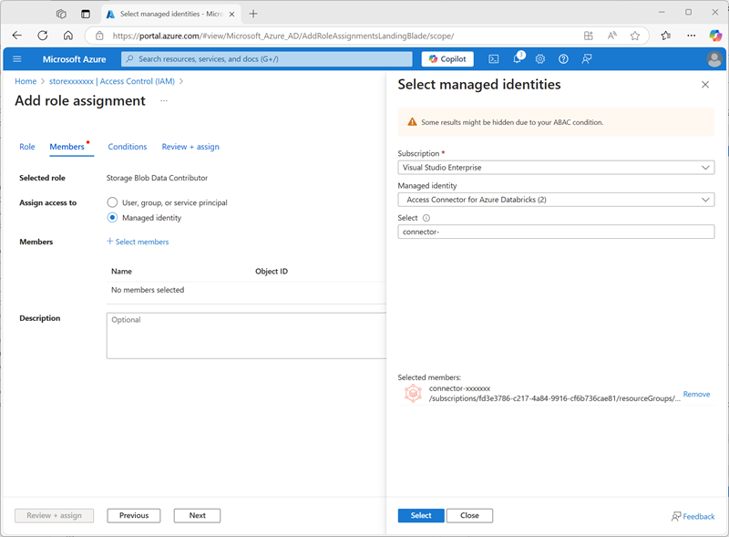

---
lab:
  title: Explorar o Catálogo do Unity no Azure Databricks
---

# Explorar o Catálogo do Unity no Azure Databricks

O Catálogo do Unity oferece uma solução de governança centralizada de dados e IA, simplificando a segurança ao fornecer um único local para administrar e auditar o acesso aos dados. Neste exercício, você configurará o Catálogo do Unity para um workspace do Azure Databricks e o usará para gerenciar dados.

> **Observação**: em alguns casos, o Catálogo do Unity pode já estar habilitado para seu workspace. Você ainda pode seguir as etapas neste exercício para atribuir uma nova conta de armazenamento ao seu catálogo.

Este laboratório levará aproximadamente **45** minutos para ser concluído.

> **Observação**: a interface do usuário do Azure Databricks está sujeita a melhorias contínuas. A interface do usuário pode ter sido alterada desde que as instruções neste exercício foram escritas.

## Antes de começar

Você precisará de uma [assinatura do Azure](https://azure.microsoft.com/free) com direitos de <u>Administrador global</u>.

> **IMPORTANTE:** este exercício pressupõe que você tenha direitos de *Administrador Global* em sua assinatura do Azure. Esse nível de acesso é necessário para gerenciar a conta do Databricks para habilitar o Catálogo do Unity em um workspace do Azure Databricks.

## Crie um workspace do Azure Databricks

> **Dica**: se você já possui um workspace do Azure Databricks de camada Premium, pode ignorar esse procedimento e usar o workspace já existente.

1. Entre no **portal do Azure** em `https://portal.azure.com`.
2. Crie um recurso do **Azure Databricks** com as seguintes configurações:
    - **Assinatura**: *Selecione sua assinatura do Azure*
    - **Grupo de recursos**: *crie um novo grupo de recursos chamado `msl-xxxxxxx` (em que "xxxxxxx" é um valor exclusivo)*
    - **Nome do workspace**: `databricks-xxxxxxx`*(em que "xxxxxxx" é o valor usado no nome do grupo de recursos)*
    - **Região**: *selecione qualquer região disponível*.
    - **Tipo de preço**: *premium* ou *avaliação*
    - **Nome do Grupo de Recursos Gerenciados**: `databricks-xxxxxxx-managed`*(em que "xxxxxxx" é o valor usado no nome do grupo de recursos)*

    

3. Selecione **Revisar + criar** e aguarde a conclusão da implantação.

## Preparar o armazenamento para o catálogo

Ao usar o Catálogo do Unity no Azure Databricks, os dados são armazenados em um repositório externo, que pode ser compartilhado em vários workspaces. No Azure, é comum usar uma conta de Armazenamento do Azure que aceita um namespace hierárquico do Azure Data Lake Storage Gen2 para essa finalidade.

1. No portal do Azure, crie um novo recurso de **conta de armazenamento** com as seguintes configurações:
    - **Noções básicas**:
        - **Assinatura**: *Selecione sua assinatura do Azure*
        - **Grupo de recursos**: *selecione o grupo de recursos existente **msl-xxxxxxx**em que você criou o workspace do Azure Databricks.*
        - **Nome da conta de armazenamento**: `storexxxxxxx`*(em que "xxxxxxx" é o valor usado no nome do grupo de recursos)*
        - **Região**: *selecione a <u>região em que você criou o workspace do Azure Databricks</u>*
        - **Serviço primário**: Armazenamento de Blobs do Azure ou Azure Data Lake Storage Gen2
        - **Desempenho**: padrão
        - **Redundância**: LRS (armazenamento com redundância local) *(para uma solução de não produção como este exercício, essa opção tem benefícios de custo e consumo de capacidade mais baixos)*
    - **Avançado:**
        - **Habilitar namespace hierárquico**: *Selecionado*
    
    

1. Selecione **Revisar + criar** e aguarde a conclusão da implantação.
1. Quando a implantação for concluída, vá para o recurso de conta de armazenamento *storexxxxxxx* implantado e use a página **Navegador de armazenamento** para adicionar um novo contêiner de blob chamado `data`. É aqui onde os dados dos objetos do Catálogo do Unity serão armazenados.

    

## Configurar o acesso ao armazenamento do catálogo

Para acessar o contêiner de blob que você criou para o Catálogo do Unity, o workspace do Azure Databricks deve usar uma conta gerenciada para se conectar à conta de armazenamento por meio de um *conector de acesso*.

1. No portal do Azure, crie um novo recurso **Conector de acesso do Azure Databricks** com as seguintes configurações:
    - **Assinatura**: *Selecione sua assinatura do Azure*
    - **Grupo de recursos**: *selecione o grupo de recursos existente **msl-xxxxxxx**em que você criou o workspace do Azure Databricks.*
    - **Nome**: `connector-xxxxxxx`*(em que "xxxxxxx" é o valor usado no nome do grupo de recursos)*
    - **Região**: *selecione a <u>região em que você criou o workspace do Azure Databricks</u>*

    

1. Selecione **Revisar + criar** e aguarde a conclusão da implantação. Em seguida, vá para o recurso implantado e, na página **Visão geral**, anote a **ID do recurso**, que deve estar no formato */subscriptions/abc-123.../resourceGroups/msl-xxxxxxx/providers/Microsoft.Databricks/accessConnectors/connector-xxxxxxx* – você precisará dela mais tarde.
1. No portal do Azure, retorne ao recurso de conta de armazenamento *storexxxxxxx* e, na página **(Controle de Acesso) IAM**, adicione uma nova atribuição de função.
1. Na lista **Funções da função de trabalho**, pesquise e selecione a função `Storage blob data contributor`.

    

1. Selecione **Avançar**. Em seguida, na página **Membros**, selecione a opção para atribuir acesso a uma **Identidade Gerenciada** e, em seguida, localize e selecione o conector de acesso `connector-xxxxxxx` do Azure Databricks que você criou anteriormente (você pode ignorar quaisquer outros conectores de acesso que foram criados em sua assinatura)

    

1. Revise e atribua a associação de função para adicionar a identidade gerenciada do conector de acesso *connector-xxxxxxx* do Azure Databricks à função colaborador de dados do blob de armazenamento para sua conta de armazenamento *storexxxxxxx* – permitindo que ela acesse dados na conta de armazenamento.

## Configurar o Catálogo do Unity

Agora que você criou um contêiner de armazenamento de blobs para seu catálogo e forneceu uma maneira de uma identidade gerenciada do Azure Databricks acessá-lo, você pode configurar o Catálogo do Unity para usar um metastore com base em sua conta de armazenamento.

1. No portal do Azure, exiba o grupo de recursos **msl-*xxxxxxx***, que agora terá três recursos:
    - O workspace do Azure Databricks **databricks-*xxxxxxx***
    - A conta de armazenamento **store*xxxxxxx***
    - O conector de acesso **connector-*xxxxxxx*** do Azure Databricks

1. Abra o recurso do workspace do Azure Databricks **databricks-xxxxxxx** criado anteriormente e, na página **Visão geral**, use o botão **Iniciar workspace** para abrir seu workspace do Azure Databricks em uma nova guia do navegador e conecte-se, se solicitado.
1. No menu **databricks-*xxxxxxx*** no canto superior direito, selecione **Gerenciar conta** para abrir o console da conta do Azure Databricks em outra guia.

    

    > **Observação**: se ***Gerenciar conta*** não estiver listado ou não abrir, talvez seja necessário que um administrador global adicione sua conta à função ***Administrador de conta*** no workspace do Azure Databricks.
    >
    > Se você estiver usando uma assinatura pessoal do Azure criada usando uma conta pessoal da Microsoft (como uma conta oultook.com), uma conta de ID do Entra "externa" poderá ter sido criada automaticamente no diretório do Azure e talvez seja necessário entrar usando esse nome de conta.
    >
    > Veja ***[esta conversa de perguntas e respostas](https://learn.microsoft.com/answers/questions/2133569/not-able-to-access-databricks-manage-account-conso)*** para obter ajuda.

1. No console da conta do Azure Databricks, na página **catálogo**, selecione **Criar metastore**.
1. Crie um novo metastore com as seguintes configurações:
    - **Nome**: `metastore-xxxxxxx`*(em que xxxxxxx é o valor exclusivo que você está usando para recursos neste exercício)*
    - **Região**: *selecione a região onde você criou seus recursos do Azure*
    - **Caminho do ADLS Gen 2**: `data@storexxxxxxx.dfs.core.windows.net/`*(em que storexxxxxx é o nome da conta de armazenamento)*
    - **ID do conector de acesso**: *a ID do recurso do conector de acesso (copiada da página Visão geral no portal do Azure)*

    

1. Depois de criar o metastore, selecione o workspace **databricks-*xxxxxxx*** e atribua o metastore a ele.

    

## Trabalhar com dados no Catálogo do Unity

Agora que você atribuiu um metastore eterno e habilitou o Catálogo do Unity, pode usá-lo para trabalhar com dados no Azure Databricks.

### Criar e carregar uma tabela

1. Feche a guia do navegador do console da conta do Azure Databricks e retorne à guia do workspace do Azure Databricks. Em seguida, <u>atualize o navegador</u>.
1. Na página **Catálogo**, selecione o catálogo **Principal** da sua organização e observe que os esquemas denominados **default** e **Information_schema** já foram criados no catálogo.

    

1. Selecione **Criar esquema** e crie um novo esquema chamado `sales` (deixe o local de armazenamento não especificado para que o metastore padrão do catálogo seja usado).
1. Em uma nova guia do navegador, faça o download do arquivo [**products.csv**](https://raw.githubusercontent.com/MicrosoftLearning/mslearn-databricks/main/data/products.csv) de `https://raw.githubusercontent.com/MicrosoftLearning/mslearn-databricks/main/data/products.csv` para o computador local, salvando-o como **products.csv**.
1. No Explorador do catálogo no workspace do Azure Databricks, com o esquema **vendas** selecionado, clique em **Criar tabela** > **.** Em seguida, carregue o arquivo **products.csv** que você baixou para criar uma nova tabela chamada **produtos** no esquema **vendas** .

    > **Observação**: talvez seja necessário aguardar alguns minutos para que a computação sem servidor seja iniciada.

    

1. Criar a tabela . Se uma descrição gerada por IA for sugerida, aceite-a.

### Gerenciar permissões

1. Com a tabela **produtos** selecionada, na guia **Permissões**, verifique se, por padrão, não há permissões atribuídas para a nova tabela (você pode acessá-la porque tem direitos administrativos totais, mas nenhum outro usuário pode consultar a tabela).
1. Selecione **Conceder** e configure o acesso à tabela da seguinte maneira:
    - **Entidades principais**: todos os usuários da conta
    - **Privilégios**: SELECT
    - **Privilégios adicionais necessários para acesso**: Conceda também USE SCHEMA em main.sales

    

### Acompanhamento da linhagem

1. No menu **+ Novo**, selecione **Consultar** e crie uma nova consulta com o seguinte código SQL:

    ```sql
    SELECT Category, COUNT(*) AS Number_of_Products
    FROM main.sales.products
    GROUP BY Category; 
    ```

1. Verifique se a computação sem servidor está conectada e execute a consulta para ver os resultados.

    

1. Salve a consulta como `Products by Category` na pasta do workspace da sua conta de usuário do Azure Databricks.
1. Retorne à página **Catálogo**. Em seguida, expanda o catálogo **principal** e o esquema **vendas** e selecione a tabela **produtos**.
1. Na guia **Linhagem** , selecione **Consultas** para verificar se a linhagem da consulta que você criou para a tabela de origem foi rastreada pelo Catálogo do Unity.

    

## Limpar

Neste exercício, você habilitou e configurou o Catálogo do Unity para um workspace do Azure Databricks e o usou para trabalhar com dados em um metastore. Para saber mais sobre o que você pode fazer com o Catálogo do Unity no Azure Databricks, confira [Governança de dados com o Catálogo do Unity](https://learn.microsoft.com/azure/databricks/data-governance/).

Se você tiver terminado de explorar o Azure Databricks, poderá excluir os recursos que criou para evitar custos desnecessários do Azure e liberar capacidade em sua assinatura.
