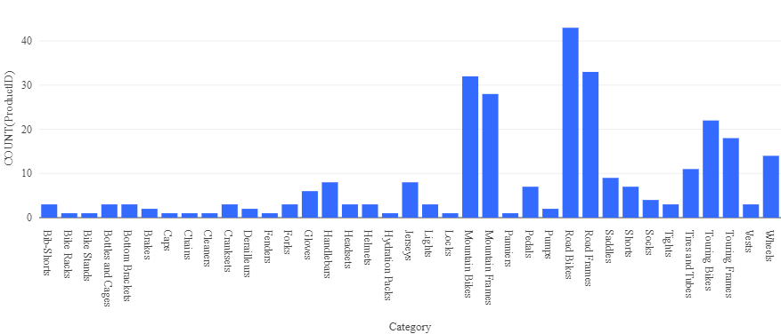

---
lab:
  title: Explorar o Azure Databricks
---

# Explorar o Azure Databricks

O Azure Databricks é uma versão baseada no Microsoft Azure da popular plataforma de código aberto Databricks.

Um *workspace* do Azure Databricks fornece um ponto central para gerenciar clusters, dados e recursos do Databricks no Azure.

Neste exercício, você provisionará um workspace do Azure Databricks e explorará alguns de seus principais recursos. 

Este exercício deve levar aproximadamente **20** minutos para ser concluído.

> **Observação**: a interface do usuário do Azure Databricks está sujeita a melhorias contínuas. A interface do usuário pode ter sido alterada desde que as instruções neste exercício foram escritas.

## Provisionar um workspace do Azure Databricks

> **Dica**: Se você já tem um workspace do Azure Databricks, pode ignorar esse procedimento e usar o workspace existente.

1. Entre no **portal do Azure** em `https://portal.azure.com`.
2. Crie um recurso do **Azure Databricks** com as seguintes configurações:
    - **Assinatura**: *Selecione sua assinatura do Azure*
    - **Grupo de recursos**: *crie um novo grupo de recursos chamado `msl-xxxxxxx` (em que "xxxxxxx" é um valor exclusivo)*
    - **Região**: *selecione qualquer região disponível*.
    - **Nome**: `databricks-xxxxxxx`*(em que "xxxxxxx" é um valor exclusivo)*
    - **Tipo de preço**: *premium* ou *avaliação*

3. Selecione **Revisar + criar** e aguarde a conclusão da implantação. Em seguida, vá para o recurso e inicie o workspace.

## Criar um cluster

O Azure Databricks é uma plataforma de processamento distribuído que usa *clusters* do Apache Spark para processar dados em paralelo em vários nós. Cada cluster consiste em um nó de driver para coordenar o trabalho e nós de trabalho para executar tarefas de processamento. Neste exercício, você criará um cluster de *nó único* para minimizar os recursos de computação usados no ambiente de laboratório (no qual os recursos podem ser restritos). Em um ambiente de produção, você normalmente criaria um cluster com vários nós de trabalho.

> **Dica**: Se você já tiver um cluster com uma versão 13.3 LTS de runtime ou superior em seu workspace do Azure Databricks, poderá usá-lo para concluir este exercício e ignorar este procedimento.

1. No portal do Azure, navegue até o grupo de recursos **msl-*xxxxxxx*** (ou o grupo de recursos que contém o workspace do Azure Databricks existente) e selecione o recurso do Serviço do Azure Databricks.
1. Na página **Visão geral** do seu workspace, use o botão **Iniciar workspace** para abrir seu workspace do Azure Databricks em uma nova guia do navegador, fazendo o logon se solicitado.

    > **Dica**: ao usar o portal do workspace do Databricks, várias dicas e notificações podem ser exibidas. Dispense-as e siga as instruções fornecidas para concluir as tarefas neste exercício.

1. Na barra lateral à esquerda, selecione a tarefa **(+) Novo** e, em seguida, selecione **Cluster** (talvez você precise procurar no submenu **Mais**).
1. Na página **Novo cluster**, crie um novo cluster com as seguintes configurações:
    - **Nome do cluster**: cluster *Nome do Usuário* (o nome do cluster padrão)
    - **Política**: Sem restrições
    - **Modo de cluster**: Nó Único
    - **Modo de acesso**: Usuário único (*com sua conta de usuário selecionada*)
    - **Versão do runtime do Databricks**: 13.3 LTS (Spark 3.4.1, Scala 2.12) ou posterior
    - **Usar Aceleração do Photon**: Selecionado
    - **Tipo de nó**: Standard_D4ds_v5
    - **Encerra após** *20* **minutos de inatividade**

1. Aguarde a criação do cluster. Isso pode levar alguns minutos.

> **Observação**: se o cluster não for iniciado, sua assinatura pode ter cota insuficiente na região onde seu workspace do Azure Databricks está provisionado. Consulte [Limite de núcleo da CPU impede a criação do cluster](https://docs.microsoft.com/azure/databricks/kb/clusters/azure-core-limit) para obter detalhes. Se isso acontecer, você pode tentar excluir seu workspace e criar um novo workspace em uma região diferente.

## Usar o Spark para analisar dados

Como em muitos ambientes do Spark, o Databricks oferece suporte ao uso de notebooks para combinar anotações e células de código interativo que você pode usar para explorar dados.

1. Faça o download do arquivo [**products.csv**](https://raw.githubusercontent.com/MicrosoftLearning/mslearn-databricks/main/data/products.csv) de `https://raw.githubusercontent.com/MicrosoftLearning/mslearn-databricks/main/data/products.csv` para o computador local, salvando-o como **products.csv**.
1. Na barra lateral, no menu de link **(+) Novo**, selecione **Adicionar ou carregar dados**.
1. Selecione **Criar ou modificar tabela** e faça o upload do arquivo **products.csv** que você baixou para o seu computador.
1. Na página **Criar ou modificar a tabela do upload de arquivo**, verifique se o cluster está selecionado na parte superior direita da página. Em seguida, escolha o catálogo **hive_metastore** e seu esquema padrão para criar uma nova tabela chamada **produtos**.
1. Na página **Explorador de catálogo**, quando a tabela **produtos** for criada, no menu de botão **Criar**, selecione **Notebook** para criar um notebook.
1. No notebook, confirme se ele está conectado ao cluster e revise o código que foi adicionado automaticamente à primeira célula; que deve ser semelhante a este:

    ```python
    %sql
    SELECT * FROM `hive_metastore`.`default`.`products`;
    ```

1. Use a opção de menu **&#9656; Executar célula** à esquerda da célula para executá-la, iniciando e anexando o cluster, se solicitado.
1. Aguarde até que o trabalho do Spark executado pelo código seja concluído. O código recupera dados da tabela que foi criada com base no arquivo que você carregou.
1. Acima da tabela de resultados, selecione **+** e, em seguida, selecione **Visualização** para exibir o editor de visualização e aplique as seguintes opções:
    - **Tipo de visualização**: Barra
    - **Coluna X**: Categoria
    - **Coluna Y**: *Adicione uma nova coluna e selecione***ProductID**. *Aplique a agregação***Contagem****.

    Salve a visualização e observe se ela é exibida no notebook, assim:

    

## Analisar dados com um dataframe

Embora a maioria dos analistas de dados se sinta confortável usando código SQL, conforme usado no exemplo anterior, alguns analistas e cientistas de dados podem usar objetos Spark nativos, como um *dataframe* em linguagens de programação como *PySpark* (uma versão do Python otimizada para Spark) para trabalhar com os dados de forma eficiente.

1. No notebook, abaixo do gráfico resultante da célula de código executada anteriormente, use o ícone **+ Código** para adicionar uma nova célula.

    > **Dica**: talvez seja necessário passar o mouse sob a célula de saída para fazer o ícone **+ Código** aparecer.

1. Entre e insira o seguinte código na nova célula:

    ```python
    df = spark.sql("SELECT * FROM products")
    df = df.filter("Category == 'Road Bikes'")
    display(df)
    ```

1. Execute a nova célula, que retorna produtos na categoria *Bicicletas de estrada*.

## Limpar

No portal do Azure Databricks, na página **Computação**, selecione seu cluster e selecione **&#9632; Terminar** para encerrar o processo.

Se você tiver terminado de explorar o Azure Databricks, poderá excluir os recursos que criou para evitar custos desnecessários do Azure e liberar capacidade em sua assinatura.
